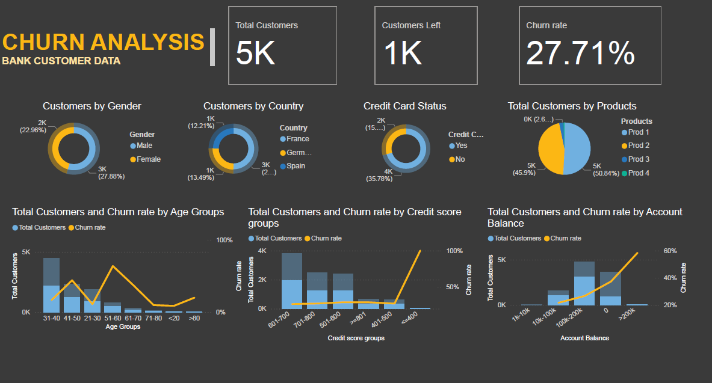

# Power-BI-Customer-Churn-Analysis
### Project Workflow
1. **Introduction** – Overview of the project.
2. **Customer Churn Analysis** – Understanding churn and its significance.
3. **Data Collection** – Importing source data using GET DATA.
4. **Data Preparation** – Cleaning, formatting, and reshaping data.
5. **Data Modeling** – Creating queries for analysis and visualization.
6. **Model View** – Reviewing and editing relationships.
7. **Data Analysis** – Creating measures using DAX.
8. **Data Visualization** – Designing and formatting visual elements.
9. **Enhancing Report** – Applying and customizing themes.

